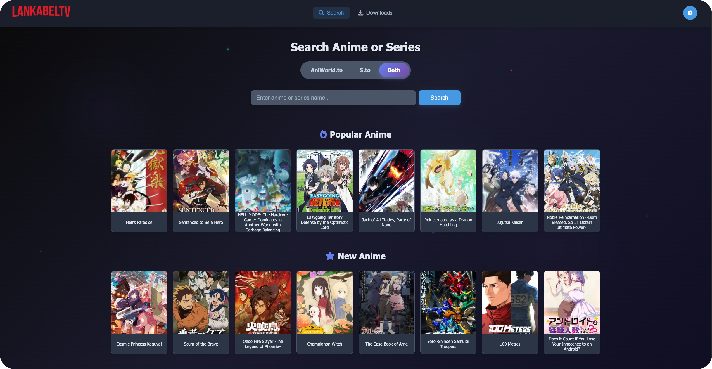

<a id="readme-top"></a>

# LankabelTV

LankabelTV ist ein leistungsstarkes All-in-One-Tool zum Herunterladen und Streamen von Anime von **aniworld.to** und Filmen/Serien von **s.to**. Es bietet ein **modernes Web-Interface**, ein robustes CLI für Power-User und ein automatisiertes Tracking-System, um deine Bibliothek aktuell zu halten.

[](LICENSE)



[](https://www.buymeacoffee.com/ayyouboss)

## 🚀 Schnellstart

**Mit Docker (Empfohlen):**

```bash
git clone https://github.com/Ayyouboss0011/LankabelTV.git
cd LankabelTV
cp .env.example .env # Konfiguriere deine Pfade in .env
docker-compose up -d --build
```
Öffne dann [http://localhost:3005](http://localhost:3005)

**Mit Python (Direkt):**

```bash
pip install --upgrade git+https://github.com/Ayyouboss0011/LankabelTV.git@next#egg=aniworld
aniworld --web-ui
```

---

## ✨ Features

- **🌐 Modernes Web-Interface**: Suchen, Entdecken und Verwalten von Downloads über ein schickes Dashboard.
- **🎬 Movie4k Integration**: Suche und downloade Filme direkt über die neue Movie4k-Integration.
- **🤖 Automatisiertes Tracking**: "Tracke" deine Lieblingsserien; das System prüft stündlich auf neue Episoden und lädt diese automatisch herunter.
- **⚡ Intelligente Warteschlange**: Verwalte mehrere Downloads gleichzeitig mit Priorisierung und automatischen Rebuilds.
- **📺 S.to & AniWorld Integration**: Gleichzeitige Suche auf beiden Plattformen.
- **📦 Umfangreiche Provider-Unterstützung**: VOE, Vidmoly, Filemoon, Vidoza, Streamtape, VidKing, SpeedFiles, und viele mehr.
- **📡 DNS-over-HTTPS**: Integrierter Cloudflare DNS-Resolver zur Umgehung von Netzsperren.
- **⏭️ Aniskip Integration**: Automatisches Überspringen von Intros und Outros.
- **👥 Syncplay Support**: Gemeinsam mit Freunden schauen in perfekter Synchronisation.
- **🐳 Docker Ready**: Einfache Bereitstellung mit Docker und Docker Compose (inkl. VPN-Unterstützung).
- **🛠️ Flexibles CLI**: Volle Kontrolle über die Kommandozeile für Automatisierung.

<p align="right">(<a href="#readme-top">back to top</a>)</p>

---

## 🖥️ Web-Interface

Das Web-UI ist das Herzstück des LankabelTV.

- **Discovery**: Beliebte und neu hinzugefügte Animes direkt auf dem Startbildschirm.
- **Kombinierte Suche**: Suche gleichzeitig auf AniWorld, S.to und Movie4k.
- **Download-Manager**: Echtzeit-Fortschrittsanzeige, Pausieren/Abbrechen und Verwaltung der Warteschlange.
- **Erweiterte Einstellungen**: Konfiguriere Download-Pfade, Sprachprioritäten und maximale gleichzeitige Downloads.
- **Benutzerverwaltung**: Integrierte Authentifizierung mit Admin-Panel für sicheren Fernzugriff.
- **Sprachpräferenzen**: Setze globale Prioritäten für Sprachen (z.B. bevorzugt "German Dub" vor "German Sub").

### Starten des Web-UI

```bash
# Basis-Start
aniworld --web-ui

# Erweiterte Optionen
aniworld --web-ui --web-port 3005 --web-expose --enable-web-auth
```

<p align="right">(<a href="#readme-top">back to top</a>)</p>

---

## 📡 Automatisiertes Tracking

Verpasse nie wieder eine Episode. Mit dem **Tracking-System** kannst du Serien überwachen.

1.  **Tracker hinzufügen**: Aktiviere beim Start eines Downloads im Web-UI einfach "Track for new episodes".
2.  **Automatische Prüfung**: Das System scannt jede Stunde nach neuen Episoden.
3.  **Auto-Download**: Neue Episoden werden automatisch zur Warteschlange hinzugefügt und mit deinen bevorzugten Einstellungen heruntergeladen.
4.  **Verwaltung**: Überwache aktive Tracker und triggere manuelle Scans im "Downloads"-Tab.

<p align="right">(<a href="#readme-top">back to top</a>)</p>

---

## 🛠️ Installation & Deployment

### Docker (Empfohlen)

Docker stellt sicher, dass alle Abhängigkeiten (`mpv`, `yt-dlp`, `ffmpeg`) korrekt konfiguriert sind.

#### 1. Konfiguration (.env)
```bash
cp .env.example .env
nano .env
```
Wichtige Variablen:
- `DOWNLOAD_DIR`: Pfad auf dem Host für die Downloads.
- `WEB_PORT`: Port für das Web-UI (Standard: `3005`).

#### 2. Start (Standard)
```bash
docker-compose up -d --build
```

#### 3. Start mit VPN (Gluetun)
Nutze `docker-compose.vpn.yml`, um den gesamten Traffic über einen VPN (via Gluetun) zu leiten. Konfiguriere dazu die VPN-Sektion in der `.env`.

```bash
docker-compose -f docker-compose.vpn.yml up -d --build
```

### Manuelle Installation

Benötigt **Python 3.9+**.

```bash
pip install --upgrade git+https://github.com/Ayyouboss0011/LankabelTV.git@next#egg=aniworld
```

*Hinweis: Für Streaming-Funktionen muss `mpv` installiert sein.*

<p align="right">(<a href="#readme-top">back to top</a>)</p>

---

## ⌨️ Kommandozeile (CLI)

| Feature | Befehl / Beispiel |
| :--- | :--- |
| **Interaktives Menü** | `aniworld` |
| **Web-Interface** | `aniworld --web-ui` |
| **Download Episode** | `aniworld --episode [URL] --output-dir ./downloads` |
| **Direkt Streamen** | `aniworld --episode [URL] --action Watch --aniskip` |
| **Syncplay** | `aniworld --episode [URL] --action Syncplay` |
| **Anime4K (Upscaling)**| `aniworld --anime4k High` |

<p align="right">(<a href="#readme-top">back to top</a>)</p>

---

## 🤝 Support & Entwicklung

Dieses Projekt basiert auf der Arbeit von [AniWorld-Downloader](https://github.com/phoenixthrush/AniWorld-Downloader). Alle neuen Features (Web-Interface, Tracking, S.to/Movie4k Integration) wurden von [Ayyouboss0011](https://github.com/Ayyouboss0011/LankabelTV) entwickelt.

- **Issues**: [Bug melden](https://github.com/Ayyouboss0011/LankabelTV/issues)
- **Discord**: Join `phoenixthrush` oder `tmaster067`

<p align="right">(<a href="#readme-top">back to top</a>)</p>

---

## ⚖️ Rechtliches

**Disclaimer**: Dieses Tool ist ein Scraper für öffentlich zugängliche Inhalte. Es werden keine Dateien gehostet. Die Nutzer sind für die Einhaltung lokaler Urheberrechtsgesetze selbst verantwortlich.

Lizenziert unter der **MIT License**..

<p align="right">(<a href="#readme-top">back to top</a>)</p>
